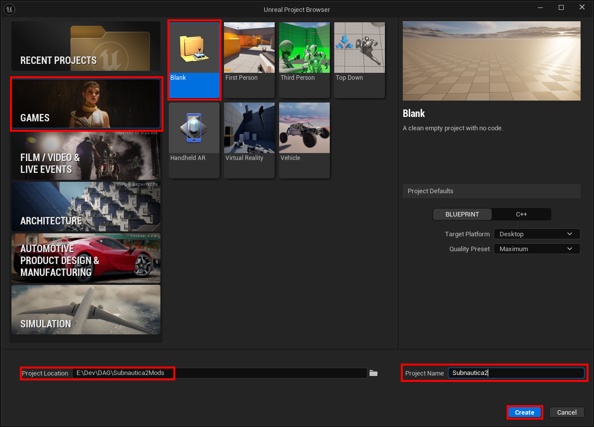
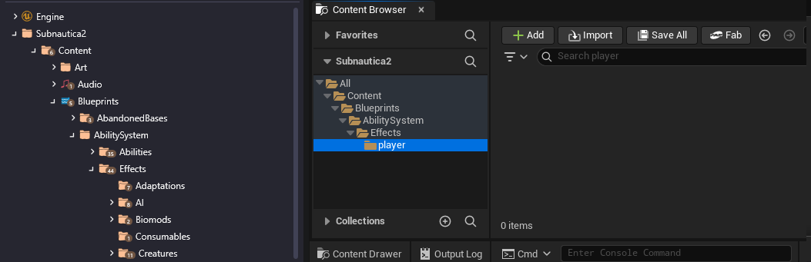
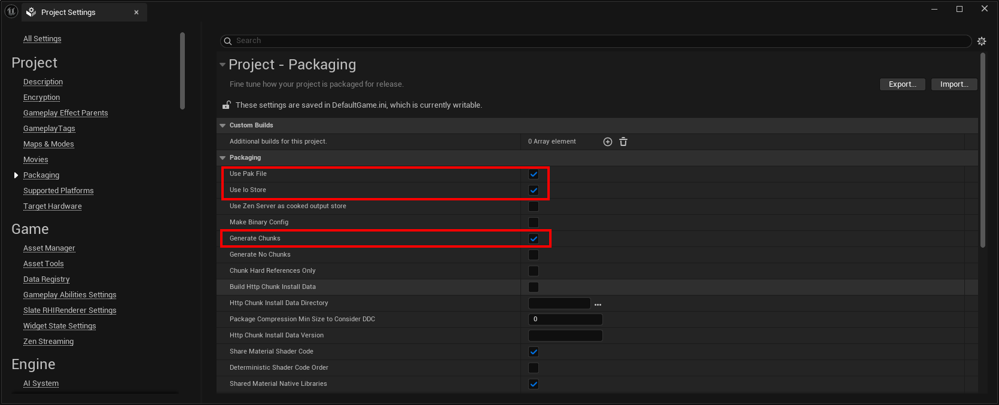

# Creating a UE5 project

Fire up Unreal Engine 5 from the Epic Games Launcher, and create a new project. We'll use this to develop some of our mods.

1. Pick the "Blank" template, ensure the type is `Blueprint` (not `C++`) and give the project a location and name. In order to work with the game, we need to call the project `Subnautica2` as our assets need to match the structure of the game:

   

2. Click "Create"

3. First up, let's add GAS - the Gameplay Ability System. This is used for a number of things in Subnautica 2, and we can leverage it to make our own changes.

4. Go to Edit > Plugins...

5. Search for "Gameplay Abilities"

6. Tick the box to the left of "Gameplay Abilities" and click the "Restart Now" button.

7. Click the "Content Drawer" in the bottom left.

8. Right click on "Content" and add a new folder, "Blueprints".

9. Add additional folders in a hierarchy: AbilitySystem, Effects, player.

10. You may notice that the folder structure looks very much like the structure you see in FModel. This is intentional!

11. Go to Edit > Project Settings...

12. Click "Packaging" and ensure these options are checked:
    - Use Pak file
    - Use Io store
    - Generate chunks

13. Close the Project S

14. Okay, that gives us a nice starter project to make some mods!