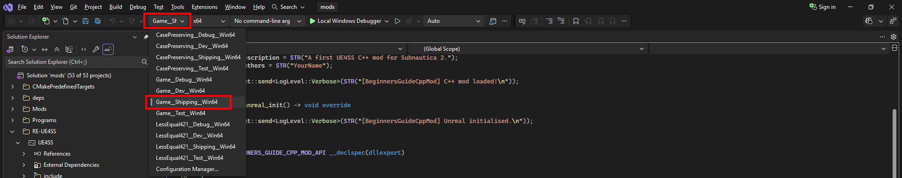

# C++ mod project template

Now that we have everything we need installed, we have some hoops to jump through to create a basic project and code structure for our mod.

## Create the source files

Create a new folder for the mod next to the `Subnautica2-UE4SS` folder, call it `BeginnersGuideCppCheatMod`.

Remember those CXX Headers that we generated from UE4SS a while back? Copy the entire `CXXHeaderDump` folder into our `mods` folder.

We now need to create a few small source files manually, then use `cmake` to generate a Visual Studio solution from them.

Create a file called `CMakeLists.txt` in the `mods` folder and paste in this text:

```cmake
cmake_minimum_required(VERSION 3.22)
project(Subnautica2CppMods)

add_subdirectory(Subnautica2-UE4SS)
add_subdirectory(BeginnersGuideCppCheatMod)
```

Then create `CMakeLists.txt` inside `BeginnersGuideCppCheatMod` and paste in this text:

```cmake
cmake_minimum_required(VERSION 3.18)

set(TARGET BeginnersGuideCppCheatMod)
project(${TARGET})

add_library(${TARGET} SHARED "src/dllmain.cpp")
target_include_directories(${TARGET} PRIVATE . "${CMAKE_SOURCE_DIR}/CXXHeaderDump")
target_link_libraries(${TARGET} PUBLIC UE4SS)

# Set this to the full path of your Subnautica 2 UE4SS mods folder
set(GAME_MODS_DIR "E:/Games/Steam/steamapps/common/Subnautica2/Subnautica2/Binaries/Win64/ue4ss/Mods")

# This will automatically create a subfolder in the Mods folder and deploy the compiled DLL as 'main.dll'
add_custom_command(TARGET ${TARGET} POST_BUILD
    COMMAND ${CMAKE_COMMAND} -E make_directory "${GAME_MODS_DIR}/${TARGET}/dlls"
    COMMAND ${CMAKE_COMMAND} -E copy $<TARGET_FILE:${TARGET}> "${GAME_MODS_DIR}/${TARGET}/dlls/main.dll"
)
```

Create a folder called `src` inside `BeginnersGuideCppCheatMod`, then a file called `dllmain.cpp` within that.

At this point, your source folders should look like this:

```
└── 📁mods
    └── 📁BeginnersGuideCheatMod
    └── 📁BeginnersGuideCppCheatMod
        └── 📁src
	        ├── dllmain.cpp
	├── CMakeLists.txt
    └── 📁CXXHeaderDump
    └── 📁Subnautica2-UE4SS
    └── CMakeLists.txt
```

Add the following code into `main.cpp`. This is a simple structure and test to prove that the mod loads:

```cpp
#include <Mod/CppUserModBase.hpp>
#include <DynamicOutput/DynamicOutput.hpp>

using namespace RC;

namespace DaftAppleGames::BeginnersGuide
{
    class BeginnersGuideCppCheatMod : public RC::CppUserModBase
    {
    public:
        BeginnersGuideCppCheatMod() : CppUserModBase()
        {
            ModName = STR("BeginnersGuideCppCheatMod");
            ModVersion = STR("1.0");
            ModDescription = STR("A first UE4SS C++ mod for Subnautica 2.");
            ModAuthors = STR("Mroshaw");

            Log(STR("C++ mod loaded!\n"));
        }

        auto on_unreal_init() -> void override
        {
            Log(STR("Unreal initialised.\n"));
        }

    private:
        // Simple helper method to log messages prefixed with the mod name
        void Log(const std::wstring& msg)
        {
            Output::send(STR("[{}] {}\n"), ModName, msg);
        }
    };

// Macro to simplify export methods to allow DLL methods to be called 'externally' by UE4SS
#define BEGINNERS_GUIDE_CPP_CHEAT_MOD_API __declspec(dllexport)
}

extern "C"
{
    // Allows UE4SS to load the mod
    BEGINNERS_GUIDE_CPP_CHEAT_MOD_API RC::CppUserModBase* start_mod()
    {
        return new DaftAppleGames::BeginnersGuide::BeginnersGuideCppCheatMod();
    }

    // Allows UE4SS to unload the mod
    BEGINNERS_GUIDE_CPP_CHEAT_MOD_API void uninstall_mod(RC::CppUserModBase* mod)
    {
        delete mod;
    }
}
```

The important pieces are the mod class and the exported `start_mod` and `uninstall_mod` functions. UE4SS uses those exported functions to create and clean up your mod. The constructor runs very early, when UE4SS loads the mod. The `on_unreal_init` function runs later, once Unreal has initialised enough for your mod to start interacting with the engine.

From the `mods` folder, generate a Visual Studio solution:

```powershell
cmake -S . -B Output
```

This will create a file called `mods.slnx` in `\mods\Output`, which is our Visual Studio solution file. 

!!! tip "Making changes to `CMakeLists.txt`"

	If you make any further changes to the `CMakeLists.txt` files, you'll need to rerun that `cmake` command, within your `mods` folder, to update your Visual Studio solution file.

## Build the DLL

You can now build your mod as a DLL:

1. Open the generated solution file in Visual Studio. In my case,  `.slnx` files were not directly associated with Visual Studio, so I had to open Visual Studio first, then choose "Open a project or solution" and select the `.slnx` file manually.

2. In the first drop down in the main toolbar, select the configuration called `Game__Shipping__Win64`:

3. Right click `BeginnersGuideCppCheatMod` in the Solution Explorer and select "Build".

4. The build takes quite a while and you'll see loads of text in the output console. Nothing to worry about, as long as the end result looks something like this:
   ```
   1>  Copying byproducts `patternsleuth_bind.lib` to E:/Dev/Subnautica-Modding/SN2/Subnautica2Mods/mods/Output/Game__Shipping__Win64/lib
   ========== Build: 1 succeeded, 0 failed, 26 up-to-date, 0 skipped ==========
   ========== Build completed at 14:25 and took 01.405 seconds ==========
   ```
5. When the build succeeds, you will find the compiled DLL in the project's output folder:

```text
\mods\Output\BeginnersGuideCppCheatMod\Game__Shipping__Win64\BeginnersGuideCppCheatMod.dll
```

!!! tip "If the build fails"
    If the project fails to build, check these things first:

    - Visual Studio has the required C++ workloads and components installed.
    - `git submodule update --init --recursive` completed successfully in `Subnautica2-UE4SS`.
    - You are building for `Game__Shipping__Win64`, not 32-bit Windows.

Phew! That took a bit of effort, but we've now built our first C++ mod for Subnautica 2!