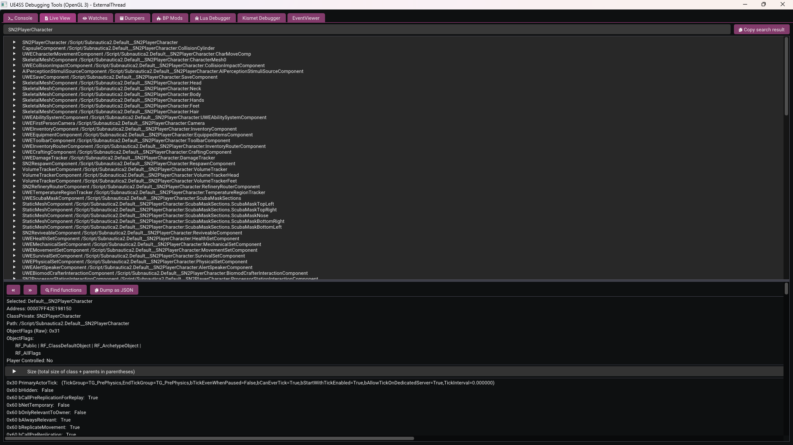
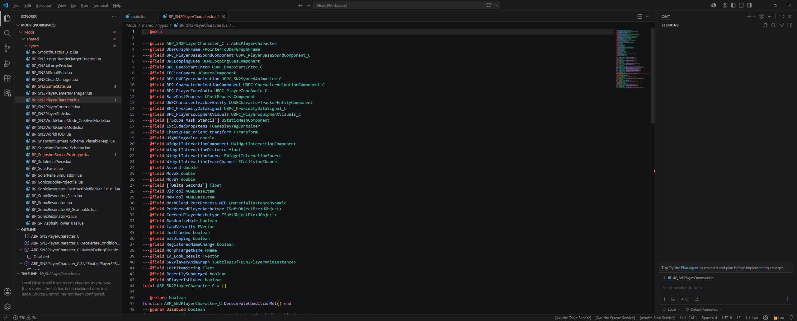
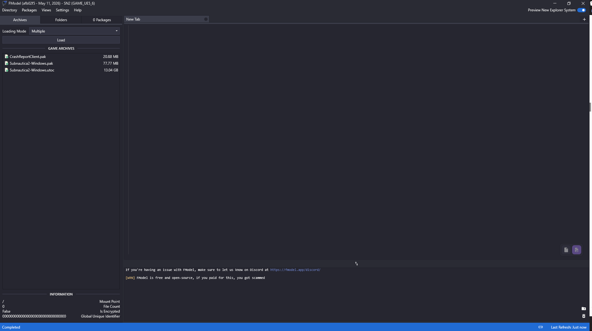
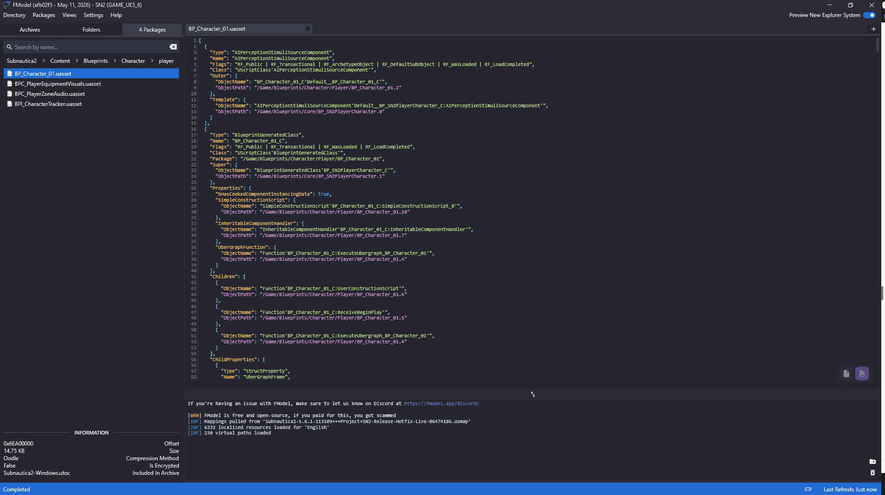
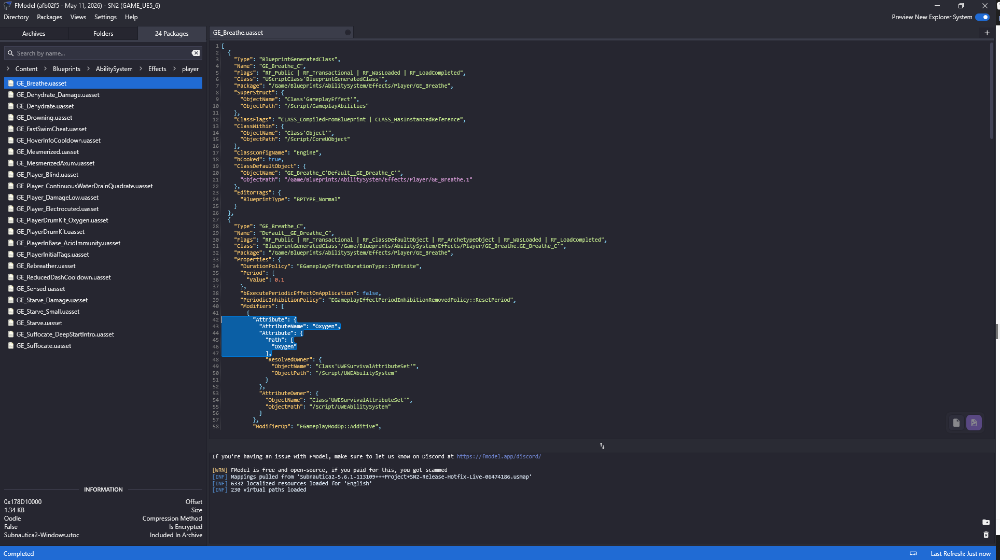

# Exploring the game

To build our mod, we first need to find out some some useful pieces of information about the game systems, properties, objects, settings and values. For example, if our goal is to modify how "oxygen" is handled in the game, we first have to find out more about how the game manages this property and how the value is modified and monitored.

## Using UE4SS

The UE4SS mod that you installed earlier is also fundamental to exploring the game and finding values and code that you might want to change.

Having installed the mod you can launch the game and you'll see the UE4SS main window. I like to drag this over to my second monitor, so that I have the main game running on my primary screen, and can refer to the UE4SS window on the other.

### Live View

Click the "Live View" tab, top left. This is where you'll spend a lot of your time. Here, you can see all of the objects present in the running game, and you can query and filter here to find things that might be relevant. Once you've found something, you can expand it and examine it's properties in real time.

A useful first tip is to right click in the search text box and select "Instances only". This filters the search results to actual instances of classes (so the actual objects themselves), rather than abstract class definitions for those objects.

Having ticked that box, back in the search field enter "Player" and hit return.

You'll see some interesting results, including a number of instances that start with "SN2Player". This feels like it might be relevant to what we want to do in our mod, so change the search field to "SN2Player", hit return, and see a more refined list of results. "SN2PlayerCharacter" looks even better, so refine the search again:

You can expand the "SN2Playercharacter" instance to see all of it's properties, as well as the superclasses from which it inherits, along with their properties.

Okay, so "SN2PlayerCharacter" looks pretty promising. Let's go back and see what UE4SS thinks about this class from a LUA perspective.

In the UE4SS folder, within `mods`, you'll find a folder named `types` - we created and populated that earlier, when we set up UE4SS. The full path is `Subnautica2\Subnautica2\Binaries\Win64\ue4ss\Mods\shared\types`. If you look in there, you'll find a couple of relevant files:

- ALI_SN2PlayerCharacter.lua - this relates to animation (Animation Layer Interface) so not anything useful for our purposes.
- BP_SN2PlayerCharacter.lua - this related to the Blue Print (BP), which we know is a unit of useful functionality in UE.

Open up `BP_SN2PlayerCharacter.lua` in VS Code and let's take a look:

This is great - lots of useful properties and functions that we could leverage for our mod!

And this is the kind of loop I find myself in when creating my mod:

1. Use View Mode to find instances of things I'm interested in.
2. Expand those to find useful properties or superclasses that may be relevant.
3. Once I've narrowed it down, search through the Blue Print (BP_) types and see what properties and functions I have access to.
4. Rinse and repeat until I have what I need.

Like most things in life, trial and error, practice and experience is everything here. The more you do this, the greater the likelihood of finding what you need first time!

## Using FModel

FModel gives you another way of exploring the assets and objects in the game. I tend to use it alongside UE4SS and the lua types files, just to expand and verify the things I've found. You may find that UE4SS gives you everything you need, if you're going for a pure LUA behaviour mod. If you're looking for other asset types, like textures and models, FModel is where you'll start.

Having configured FModel to point to Subnautica 2, you should now see something like this:

As the game is built using Unreal 5.6 using Io Store, we're interested in the "utoc" file, so double click that.

Expand "Subnautica > Content" and you'll start to see some of the content and components that make up the game.

### Finding the player character blueprint

A good starting point is the player character blueprint:

1. Navigate to "Subnautica2 > Content > Blueprints > Character > player"
2. Find the `BP_Character_01` blueprint.
3. Double click it to export it as JSON, and FModel will display the asset's full structure in the right-hand panel:

This JSON output describes the blueprint - its components, properties, and references to other assets. It can look intimidating at first, but you don't need to read all of it. What you're typically looking for is confirmation that an asset exists, its full content path, and references to other classes or components you might want to target.

You'll notice that the class names and property names here mirror what you saw in the UE4SS Live View, and what appears in the generated Lua type files - for example, BP_SN2PlayerCharacter.lua. This is the bridge between the three tools: UE4SS shows you live instances at runtime, the Lua types give you the API surface for scripting, and FModel lets you inspect the underlying asset structure offline.

### Finding gameplay effects

For survival-related behaviour - things like oxygen consumption, hunger, and thirst - the relevant assets live under "Subnautica2 > Content > Blueprints > AbilitySystem > Effects > player".

Here you'll find gameplay effects like GE_Breathe, GE_Suffocate, GE_Starve, and others. Double clicking any of these will show you their JSON structure, including the attribute modifiers they apply and the values they operate on:

This is particularly useful when you want to understand what a gameplay effect does before you try to interact with it in Lua - for instance, confirming which attribute set and property name is being modified, so your Lua code targets exactly the right thing.

### When to use FModel vs UE4SS Live View

As a rough guide:

- UE4SS Live View is your tool for runtime exploration - finding live instances of objects, inspecting current property values, and understanding what's active in a running game session.
- FModel is your tool for offline exploration - browsing the full asset library, reading blueprint definitions, and cross-referencing class structures without needing the game running.

In practice, you'll often use them together: find something interesting in UE4SS, then look it up in FModel to understand its full structure and any related assets.
