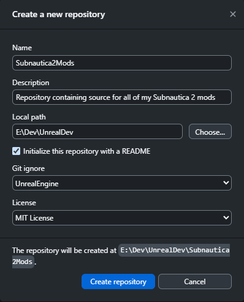

# Creating a git repository

A git repository offers several benefits:

- It allows you to keep a version history of your mod code. This is invaluable when, inevitably, you make a change to your code that breaks everything! With a git repo, you can always restore a previous, working version.

- It makes sharing code with the community really easy.

- It enables collaboration between multiple developers on big mod projects.

I use GitHub and their GitHub Desktop tool, so that's what I'll use in the example. There are other systems and other tools, and you should use what you're most comfortable with.

!!! tip

    I highly recommend this as the first step before you do anything else! I promise you, you won't regret it and it may end up saving you a lot of time and hassle in the long run!

## Install GitHub Desktop

Simply download the GitHub Desktop installer, run it, and follow the instructions. This tool is not specific to Subnautica mod development, so I tend to let it install in the default folder location.

## Creating a Repository

Some people create individual repositories for each mod they make, some people have one repository for everything, and some have a bit of both. I like to keep everything in one, as I find it's just simpler that way.

To create a repository:

1. First up, you'll need to go to [github.com](https://github.com/) and create yourself an account, if you don't already have one.

2. Fire up GitHub Desktop and sign into your account.

3. Go to File > New repository...

4. Give your repository a name, for example "Subnautica2Mods".

5. Add a description.

6. In "local path", pick the dev folder that you created earlier.

7. I like to include a README file, so tick the "Initialise this repository with a readme" checkbox.

8. You can select the "UnrealEngine" git ignore default. This will create a file called `.gitignore` that we can use to filter out some files that we don't want to include in our repo, like the `shared` files we created in UE4SS.

9. You can pick whatever license you want, if you plan to make the repository public. I default to "MIT License" as that seems to be about right for me:

10.  Click "Create repository".

11. In Windows Explorer, go into the created folder and create another folder called `mods`

12. You should now have a folder structure something like this:

    ```
    └── 📁UnrealDev
        └── 📁FModel
        └── 📁retoc
        └── 📁Subnautica2Mods <-- this is our repository
            └── 📁mods      <-- this is where we dev mods and these are loaded by UE4SS
        └── 📁UAssetGUI
    ```

We'll configure the `.gitignore` file, and commit the code for our first mod, later in the guide.
