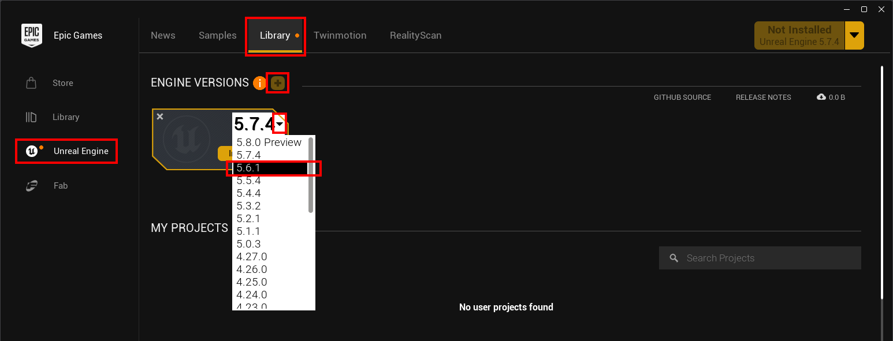

# Installing Unreal Engine

Now we're getting to the heavy hitters. For simple LUA mods, you do not need the full Unreal Engine. It's essential when you get to developing more complex mods, and I suggest setting it up only when you need to.

Installing Unreal 5 set up is relatively easy:

1. Download and install the Epic Games Launcher and run it.
2. Run the Launcher.
3. Click "Unreal Engine" on the left, and click the "Library" tab.
4. Click the "+" button next to "Unreal versions", then click the little drop down to select the version you want to install:
5. Once you've selected the version, click the "Install" button.
6. Select a target folder and click Install. I like to keep everything together, but you can install it anywhere:

There's a bit more to setting up an Unreal Engine project for developing Subnautica 2 mods, but that's covered in more details in the "Advanced modding" section of the guide.
