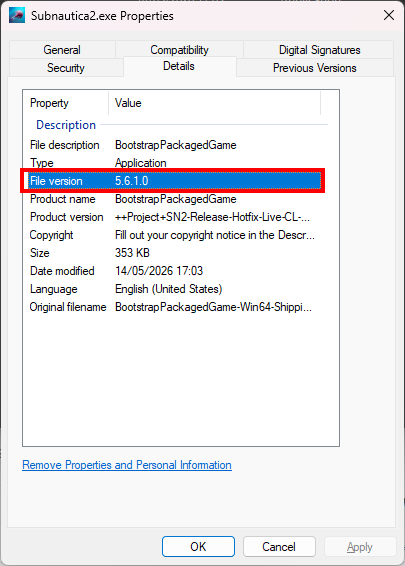

# Software you'll need

Depending on the mod you're making, you'll want to download and install some tools. What you download and install really depends on what you want to do and how you plan to implement and package your mod.

## Essential

Irrespective of what you are making, you'll want to download and install these tools:

-   **UE4SS** - a fork of the UE4SS tool specifically built for Subnautica 2. This is the mod developers best friend, and required by players who want to play your LUA based mod. UE4SS allows you to explore the game mechanics, pinpoint things you might want to change, and test your results.
-   **FModel** - allows you to browse the Subnautica 2 game structure, assets, and systems. This is essential in helping you identify core systems and components that you might want to change or target in your mod.

## Optional

-   **Visual Studio Code** - a nice IDE for editing LUA code.
-   **retoc** - rtoc is a command line tool for packing/unpacking Unreal Engine IoStore containers (.utoc/.ucas). Can be used to package mods without a full UE installation.
-   **UAssetGUI** - a tool to help repackage assets without the need for the full UE installation. Some scenarios still require the full UE installation.
-   **Unreal Engine** - the full game engine. Only needed if you want to go full on into creating your own systems, assets, behaviours etc. Might also be useful for repackaging modified assets, depending on the nature of your mod.
-   **Visual Studio** - this can be required by complex mods that need the Windows build pipeline and the Windows SDK.
-   **GitHub Desktop** - not mandatory, but good to manage your source code in a Git repository, which will allow you to share and collaborate with others.
-   **Vortex** - a plugin manager from Nexusmods. Not essential, but handy for installing and managing mods in the games.

## Downloads

Here's a simple checklist of the tools that I've used in this tutorial and where to get them:

| Category  | Tool Name                        | Where to download                                            |
| --------- | -------------------------------- | ------------------------------------------------------------ |
| Essential | UE4SS (Subnautica 2 DEV version) | [Nexusmods.com](https://www.nexusmods.com/subnautica2/mods/36) / [Github.com](https://github.com/Subnautica2Modding/Subnautica2-UE4SS/releases) |
| Essential | Fmodel                           | [Fmodel.app](https://fmodel.app/)                            |
| Optional  | Visual Studio Code               | [Visualstudio.com](https://code.visualstudio.com/)           |
| Optional  | retoc                            | [Github.com](https://github.com/trumank/retoc/releases)      |
| Optional  | UAssetGUI                        | [Github.com](https://github.com/atenfyr/UAssetGUI/releases)  |
| Optional  | Unreal Engine 5                  | [Unrealengine.com](https://www.unrealengine.com/download)    |
| Optional  | Visual Studio Community Edition  | [Microsoft.com](https://visualstudio.microsoft.com/vs/community/) |
| Optional  | GitHub Desktop                   | [Github.com](https://desktop.github.com/)                    |
| Optional  | Vortex                           | [Nexusmods.com](https://www.nexusmods.com/site/mods/1?tab=files) |

## Unreal Engine Version

At the time of writing, Subnautica 2 was built using Unreal Engine 5.6.1.0. This may well change over time. You can find out the exact version at any point in time by right clicking the `subnautica2.exe` file, select "Properties" and click "Details":

## A note on tools

Now, there are loads of other tools and applications out there that can be used in modding games. The ones I’ve listed above have given me everything I need to make the simple mods I’ve been building, but you may find you need something more, or something different. There’s no right answer to what tools and software to use: have a look around, and find the right thing for you and for what you want to do.

Something to be very aware of is that development of these tools is pretty active and things tend to change quite frequently. It's really, really important to avail yourself of the latest versions and double check compatibility and support between various tools and game versions.

Finally, if you use other mods like UE4SS or Mod Loaders, etc, don't forget to endorse them on Nexusmods.

Once you’ve got everything you need downloaded, let’s get it all setup and ready to go.
