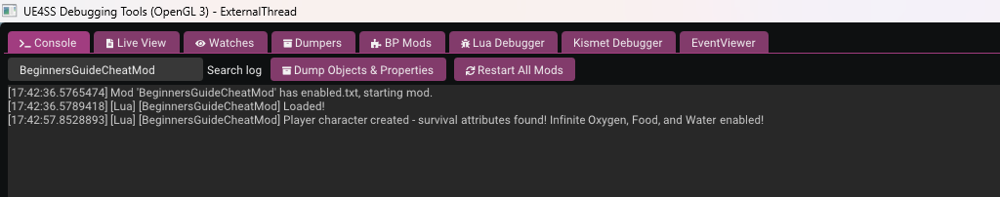

# Testing your mod

Let's see if our mod is working:

1. Run the game.
2. Keep an eye on the UE4SS console - you can add a filter to the search log to only show output from your mod: `BeginnersGuideCheatMod`
3. Start a new game or load a save.
4. When the player spawns you should see some output in the console:
5. Dive underwater, and you should see the player Oxygen attempts to drop but is reset to maximum every half a second.

Success!

If you want to tweak anything in the code, don't forget to set `debugMode = true` and then use CTRL + r to hot reload. If you forget to set the debugMode, the reference to the `UUWESurvivalAttributeSet` will be lost and not set again until the player object respawns.
